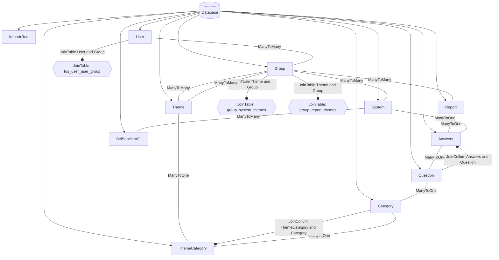

# itstyr

Styringsværktøj til IT projekter

## Setup locally

### Preset

Make sure you have a set of JSON files for testing import Commands.

### Start Docker containers

```sh
docker compose up -d
docker compose exec phpfpm composer install
docker compose exec phpfpm bin/console doctrine:migrations:migrate --no-interaction
```

### Create a super admin user

```sh
docker compose exec phpfpm bin/console SuperUser
```

### Access the site

You should now be able to browse to the application

```

open "http://$(docker-compose port nginx 8080)"

```

## Import systems and reports

```sh
docker compose exec phpfpm bin/console itstyr:import:system <URL>
docker compose exec phpfpm bin/console itstyr:import:report <URL>
```

### Flowchart

A helpful flowchart over the Entities, and Joinedtables.
Ilustrative figures meaning:

1. Database = Database
2. Black square = Entities
3. Grey square = relations
4. Hexagon = Joinedtables
5. arrow = relation between DB and Entity
6. bulletin = shows the mapping Entities in Jointables, and JoinCollums



