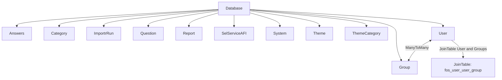

# itstyr
Styringsværktøj til IT projekter

## Setup locally

### Start Docker containers

```sh
docker compose up -d
docker compose exec phpfpm composer install
docker compose exec phpfpm bin/console doctrine:migrations:migrate --no-interaction
```

### Create a super admin user

```sh
docker compose exec phpfpm bin/console fos:user:create --super-admin
```

### Access the site

You should now be able to browse to the application

```

open "http://$(docker-compose port nginx 8080)"

```

## Import systems and reports
```sh
docker compose exec phpfpm bin/console itstyr:import:system PATH
docker compose exec phpfpm bin/console itstyr:import:report PATH
```




